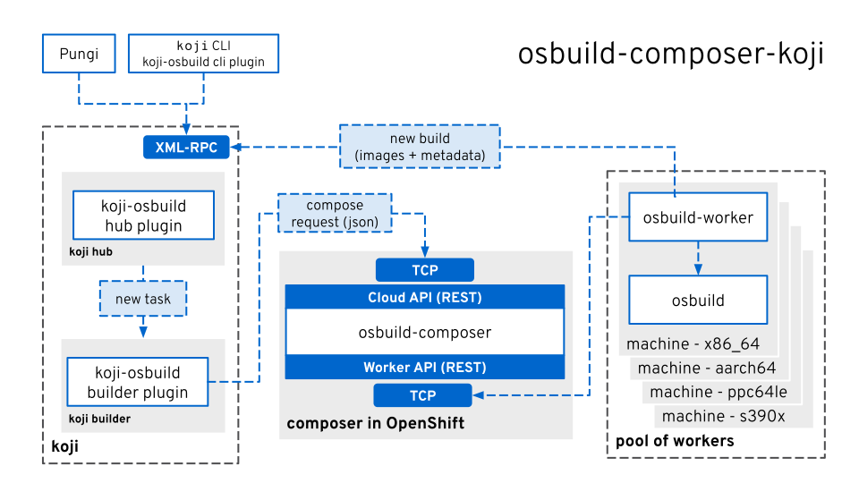

# Koji osbuild

This project provides osbuild integration with Koji. It makes it possible
to build images and other OS artifacts via osbuild-composer through koji,
This is done via three plugins:

 - Koji **hub** plugin: Provides a new XMLRPC API endpoint that clients
   can use to create new `osbuildImage` Koji tasks.

 - Koji **builder** plugin: Handles `osbuildImage` Koji tasks and will talk
   to osbuild-composer to create new composes via composer's Koji API.

 - Koji **cli** plugin: Adds a new `osbuild-image` to the existing `koji`
   command line client. This will then use the new XMLRPC API to request a
   new compose.

The following image visualizes the overall architecture and integration
points of `koji-osbuild` with `koji`/`brew` and Composer:



## Installation

The plugins need to be installed on the machines running the corresponding
services. Installation via RPMs is recommended. The RPMs for the latest git
commit of the source can be easily created via meson:

```
meson . build
ninja -C build rpms
```

The RPMs should then be in `build/rpmbuild`. The hub and builder plugin
also need to be explicitly enabled in the respective configuration files.
The *hub* plugin configuration file at `/etc/koji-hub/hub.conf`. The
plugin is enabled by adding `osbuild` to the `Plugins` directive. The
*builder*: configuration file at `/etc/kojid/kojid.conf`. Here `osbuild`
needs to be added to the `plugin` directive.
For an example, see the test container configuration files
[`hub.conf`](test/container/hub/hub.conf) for the hub and
[`kojid.conf`](container/builder/kojid.conf) for the builder.

Additionally, an osbuild-composer instance, at least version 21, with the
koji API enabled needs to be running and reachable via TCP from the host
running the koji builder.


## Configuration

The builder plugin needs to be configured via a `builder.conf` file that
can be located in either `/usr/share/koji-osbuild` or `/etc/koji-osbuild`.

```ini
[composer]
# The host, port and transport (https vs http) of osbuild composer
# NB: The 'https' transport is required for SSL/TLS authorization
server = https://composer.osbuild.org

# Authorization via client side certificates: can be either a pair of
# certificate and key files separated by comma or a file combining both.
ssl_cert = /share/worker-crt.pem, /share/worker-key.pem

# Verification of the server side: either a boolean (True / False) to
# enable or disable verification, or a path to a CA_BUNDLE file or a
# directory containing certificates of trusted CAs.
ssl_verify = /share/worker-ca.pem

[koji]
# The URL to the koji hub XML-RPC endpoint
server = https://koji.fedoraproject.org/kojihub
```


## Development

See [`HACKING.md`](HACKING.md) for how to develop and test this project.
